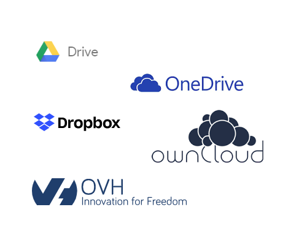
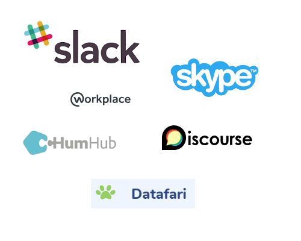
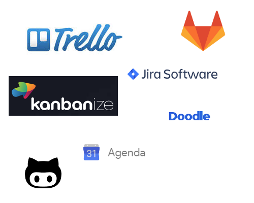
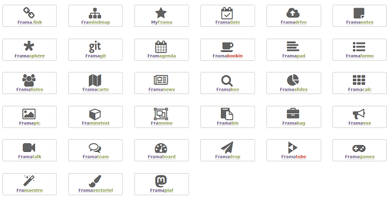

<!-- page_number: true -->
<!-- footer: Outils du travail collaboratif -->

Outils du travail collaboratif
===

##### Découverte et pratique

###### par [Fabien Barbaud](fabien.barbaud@timeonegroup.com) - [@BarbaudFabien](https://twitter.com/BarbaudFabien)

---

# Le travail collaboratif, c'est quoi ?

[Gladys](https://gladys.com/fr)

---

# Le travail collaboratif, c'est quoi ?

## Définition

> La notion de travail collaboratif désigne un travail qui n'est plus fondé sur **l'organisation hiérarchisée traditionnelle**, et plus spécifiquement un mode de travail (éventuellement intégré dans un modèle économique de production) où collaborent de nombreuses personnes grâce aux **technologies de l'information et de la communication**, notamment les plateformes internet.

[Wikipédia - Travail collaboratif](https://fr.wikipedia.org/wiki/Travail_collaboratif)

---

# Le travail collaboratif, c'est quoi ?

## Collaboratif VS coopératif

- le travail **coopératif** est une **coopération** entre plusieurs personnes qui interagissent dans un but commun mais se partagent les tâches,
- le travail **collaboratif** se fait en collaboration du début à la fin **sans division fixe des tâches**.

[Wikipédia - Travail collaboratif](https://fr.wikipedia.org/wiki/Travail_collaboratif)

---

# Et les outils ?

---

# Et les outils ?

## Les outils non collaboratifs

- l'email
- les réunions
- l'email

---

# Et les outils ?

## Les cas d'usage

- stockage, partage et modification de fichiers
- communication
- suivi et gestion de projets
- conception collaborative
- ...

---

# Et les outils ?

## Stockage, partage et modification de fichiers

- stockage (cloud)
- partage (gestion de droit)
- versionnement (historisation des modifications)
- commentaire (construction collaborative)
- ...

---

# Et les outils ?

## Stockage, partage et modification de fichiers

---

# Et les outils ?

## Stockage, partage et modification de fichiers

### Benchmark

| Produit | Editeur | _Saas*_ | Pour | Contre | Coût |
|---|---|---|---|---|---|
|Google Drive|Google|Oui|||Freemium|
|...|
|...|

_Saas : Software as a Service_

---

# Et les outils ?

## Communication

- partage des informations liées à la vie de l'entreprise (RSE - Réseau social d'entreprise)
- messagerie interne (chat),
- espaces d'échange et forums,
- moteur de recherche interne,
- ...

---

# Et les outils ?

## Communication

---

# Et les outils ?

## Communication

### Benchmark

| Produit | Editeur | _Saas_ | Pour | Contre | Coût |
|---|---|---|---|---|---|
|...|
|...|
|...|

---

# Et les outils ?

## Suivi et gestion de projets

- organisation de réunions et de rendez-vous (agenda),
- gestion de tâches (Kanban, ToDo)
- suivi des développements (_VCS_*)
- ...

_VCS : Version Control System_

---

# Et les outils ?

## Suivi et gestion de projets

---

# Et les outils ?

## Suivi et gestion de projets

### Benchmark

| Produit | Editeur | _Saas_ | Pour | Contre | Coût |
|---|---|---|---|---|---|
|...|
|...|
|...|

---

# Conception collaborative

La conception collaborative (_Product Lifecycle Management_) consiste à réduire le cycle
de conception en facilitant la circulation de l'information, les échanges de données techniques et le suivi
d'exécution du projet au sein de ces équipes élargies et disparates.

[Fiche pratique - Les outils du travail
collaboratif](http://www.digne.cci.fr/IMG/pdf/Fiche_47_-_Technos-Les_outils_du_travail_collaboratif.pdf)

---

# Un peu de logiciel libre

## Framasoft

[Dégooglisons Internet](https://degooglisons-internet.org/fr/list/)

---

# Un peu de logiciel libre

## Framasoft

### Benchmark

| Produit | Editeur | _Saas_ | Pour | Contre | Coût |
|---|---|---|---|---|---|
|...|
|...|
|...|

---

# Comment choisir vos outils

## La définition du besoin

- Quels sont les problèmes actuels ?
- Qui sont les acteurs ?
- Quel est l'environnement technologique ?
- Quelle est la culture d'entreprise/de l'équipe ?

---

# Comment choisir vos outils

## Le budget

- Open source != gratuit
- Moyens activables (ressources internes)
- Économie
- Contrôle des coûts

---

# Comment choisir vos outils

## Le déploiement

- Qui fait quoi ?
- Quelle formation ?
- Quel accompagnement ?
- Point d'étape

---

# Un peu de pratique

Vous êtes une société de conseil qui doit proposer à des groupes/des équipes un nouvel environnement de travail leur permettant de produire dans de meilleures conditions.
Votre objectif est de proposer un écosystème viable dans le temps et adapté aux profils des utilisateurs.

**Restition :** liste du ou des outils à mettre en place et argumentaire

---

# Un peu de pratique

## Cas startup - App mobile

- 80% freelance
- Pas de bureau
- Equipement personnel hétéroclite
- Bonne connexion internet

---

# Un peu de pratique

## Cas PME - agence de communication créa

- Des bureaux sur plusieurs sites géographique
- Système d'information unifié (sous Mac)
- Divers niveaux de compréhension des technologies (print, web, radio, ...)
- Connexion haut débit fibre inter-site

---

# Un peu de pratique

## Cas projet étudiant

- Projet de fin d'étude sur plusieurs mois
- Des cours une semaine sur quatre
- Equipement personnel hétéroclite
- Une deadline de restition imposée

